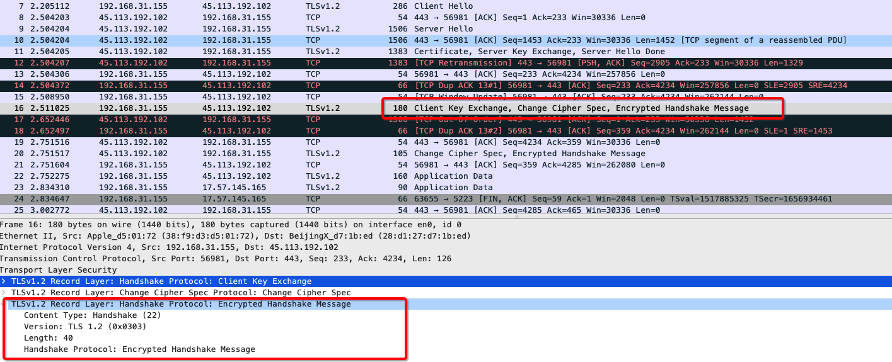

## Diffie- Hellman 密钥交换算法

DH算法属于公钥加密算法

公钥加密算法加解密复杂，花费时间久

**加解密数**据时使⽤**对称密码算法**，**密钥管理**使⽤**公钥密码**技术

**其解决问题的主要思想**可以用下图来解释

​	具体交换的过程如下：

1. Alice和Bob协商一个有限循环群和它的一个生成元，一个大素数;

2. Alice生成一个随机数，计算，将发送给Bob；

3. Bob生成一个随机数，计算，将发送给Alice；

4. Alice计算%5Ea%20mod%5C%20p)，得到共享密钥；

5. Bob计算%5Eb%5C%20mod%5C%20p)，得到共享密钥；

   >
   >
   >%5Ea%3D(g%5Ea)%5Eb)因为群是乘法交换的，涉及到数论及代数的内容。Alice和Bob同时协商出，作为共享密钥。

## TLS握手过程

1.Client Hello

- TLS Version，TLS的版本号
- Cipher Suite，客户端支持的加密套件列表；加密算法秘钥长度等等
  - Client Random，随机数，

2. Server Hello

- TLS Version

- 服务端选中的加密组件，从客户端发送过来的加密套件中选择其中一个

- Server Random，服务端生成的随机数

  

3. Certificate

- 服务器的公钥证书 (被CA签过名的)

4. Server Key Exchange

- Server Params，ECDHE算法需要用到

  
  
  >
  >
  >ECDHE是一种秘钥交换算法
  >
  >为了防止伪造，Server Params是经过服务器的私钥签名的

5. Server Hello Done

   告诉客户端：协商部分结束

   目前为止，客户端和服务器端共享了

   	1. Client Random
   	2. Server Random
   	3. Server Params

   并且，客户端已经得到了服务器给过来的证书（包含公钥），接下来客户端需要验证证书是否真实有效

   

6. Client Key Exchange

   * Client Params，ECDHE算法需要用到

     

   到这一步，客户端和服务端都拥有了Server Params 、Client Params；

   客户端和服务器端都可以使用ECDHE算法根据Server Params、Client Params计算出一个新的随机秘钥串Pre-master Secret

7. Change Cipher Spec

   告知服务器之后的通信会采用计算出来的会话秘钥进行加密

   

8. Finished

   1. 包括链接到这一步所有的报文的摘要值，加密之后发送给服务器
   2. 这次握手是否成功要以服务器是否能够正确解密报文作为判断标准

   

9. Change Cipher Spec

10. Finished

    1. 到此为止，客户端服务器都验证了加解密没有问题，握手正式结束
    2. 后面开始传输加密的请求和响应

